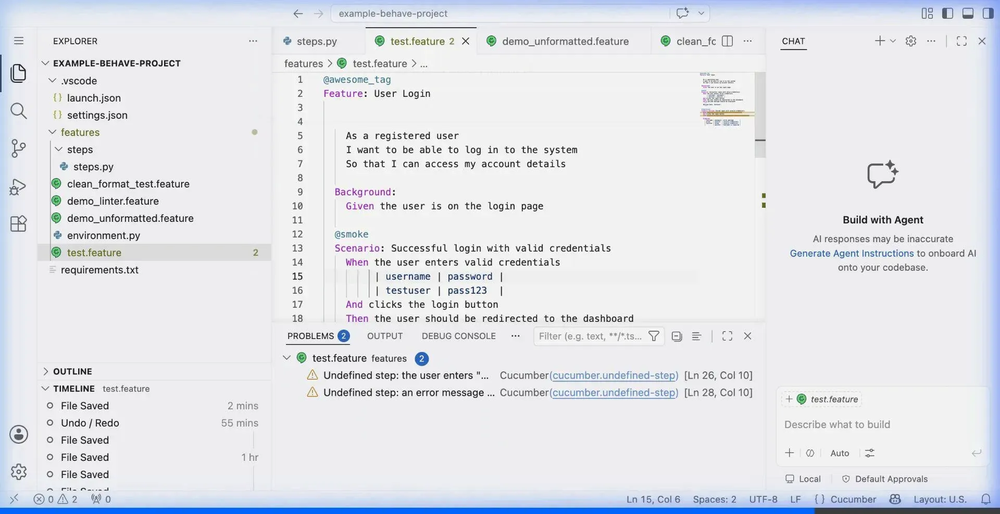
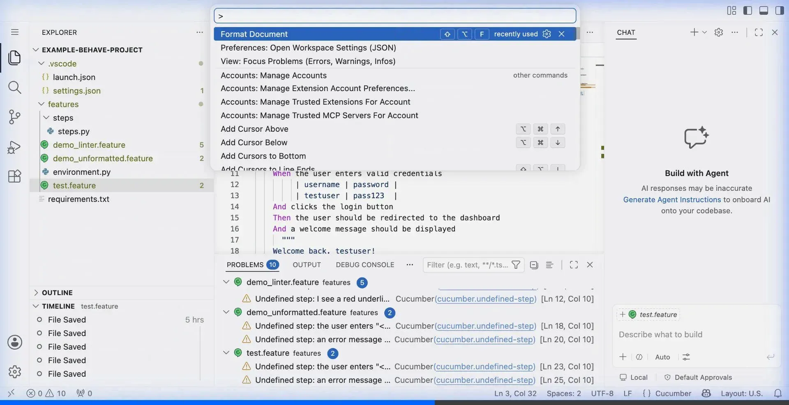

<!-- markdownlint-disable-file MD041 -->
<div align="center">
  <h1>Gherkin PowerTools</h1>
  <br/><br/>

  <p><em>The ultimate professional formatting and productivity suite for Gherkin <code>.feature</code> files in VS Code.</em></p>

  <p>
    <a href="https://marketplace.visualstudio.com/items?itemName=carloscamara.vscode-gherkin-powertools">
      
    </a>
    <a href="https://marketplace.visualstudio.com/items?itemName=carloscamara.vscode-gherkin-powertools">
      
    </a>
    <a href="https://marketplace.visualstudio.com/items?itemName=carloscamara.vscode-gherkin-powertools#review-details">
      
    </a>
  </p>
  <p>
    
    
    <a href="./LICENSE">
      
    </a>
  </p>
  <p>
    <a href="https://github.com/carlos-camara/vscode-gherkin-powertools/actions/workflows/test.yml">
      
    </a>
    <a href="https://github.com/carlos-camara/vscode-gherkin-powertools/actions/workflows/e2e.yml">
      
    </a>
    <a href="https://github.com/carlos-camara/vscode-gherkin-powertools/actions/workflows/lint.yml">
      
    </a>
  </p>

</div>

---

**Gherkin PowerTools** transforms chaotic, hand-edited `.feature` files into perfectly aligned, professionally formatted BDD specifications — in milliseconds. Built natively for VS Code, it integrates directly with the editor's formatting API, live diagnostic linter, and navigation system to supercharge your behavior-driven development workflow.

Works seamlessly with any Gherkin-based framework: **Cucumber** · **Behave** · **SpecFlow** · **Karate** · **pytest-bdd**

---

## 📑 Table of Contents

- [Core Capabilities](#-core-capabilities)
- [Official Documentation](#-official-documentation)
- [Enterprise-Grade Quality](#️-enterprise-grade-quality)
- [Features](#-features)
- [Keyboard Shortcuts](#️-keyboard-shortcuts)
- [Configuration](#️-configuration)
- [Installation](#-installation)
- [Roadmap](#️-roadmap)
- [Contributing](#-contributing)
- [Support & Sponsors](#-support--sponsors)
- [License](#-license)

---

## ✨ Core Capabilities

| | Feature | Description |
|:---:|---------|-------------|
| 🧠 | **AST Parser Engine** | Built on the official `@cucumber/gherkin` package for flawless, mathematically precise code analysis. |
| 🎨 | **Intelligent Formatter** | Auto-indentation, dynamic table alignment, auto-casing, and tag wrapping based on AST localization. |
| 🔍 | **Live Diagnostics Linter** | Real-time syntax error detection instantly mapped to VS Code diagnostics. |
| 💡 | **Code Actions (Quick Fixes)** | Instantly auto-correct syntax errors, missing colons, misspelled keywords, and generate missing step definitions. |
| 🧭 | **Go To Definition** | Instantly jump from `.feature` steps to their underlying Python implementations with a single click. |
| 📊 | **Project Analytics V4** | Beautiful HTML glassmorphism dashboard providing comprehensive metrics for your entire BDD workspace. |
| 🌙 | **Syntax Highlighting** | Curated VS Code color palette tailored specifically for dark themes. |
| 📝 | **Intelligent Snippets** | Instant scaffolding for `Feature`, `Scenario`, `Scenario Outline`, and `Rule` blocks. |
| 🌐 | **i18n Support** | Format keywords in English, Spanish, French, and German natively. |
| 🛡️ | **Enterprise CI/CD & E2E** | Rigorous automated Native UI E2E Testing, Security Audits, and Cross-Platform Unit Coverage. |

---

## 📚 Official Documentation

Want to master the extension? Our comprehensive guides, architecture overviews, and feature deep-dives are hosted on our dedicated documentation website.

<br>
<div align="center">
  <a href="https://carlos-camara.github.io/vscode-gherkin-powertools/">
    
  </a>
</div>
<br>

---

## 🛡️ Enterprise-Grade Quality

We treat extension stability seriously. Our architecture incorporates an extensive, fully automated quality assurance pipeline powered by GitHub Actions:

- **End-to-End Native UI Tests:** We use `@vscode/test-electron` to boot a real VS Code instance in a virtual buffer (`xvfb`). It dynamically opens Gherkin files, triggers real formatting commands (`editor.action.formatDocument`), checks real Document Symbols, and validates live Diagnostics generation directly from the GUI.
- **Cross-Platform Unit Testing:** Instantaneous Mocha test suites ensure AST processing and configuration algorithms are rock solid across `ubuntu-latest`, `macos-latest`, and `windows-latest`.
- **Automated Security Gating:** Nightly `npm audit` pipelines instantly block PRs introducing vulnerable dependencies.
- **Strict Linting & Metrics:** Complete coverage tracking and codebase linting ensures the highest engineering standards are maintained before any release reaches the Marketplace.

## ✨ Features

### 🧠 Smart Autocomplete (IntelliSense)
Typing Gherkin steps has never been faster. Our **Smart Autocompletion Provider** dynamically reads all your Python step definitions (`@given`, `@when`, `@then`) and offers them as intelligent suggestions the moment you type a keyword (e.g. `Given`).
- **Snippet Variables**: Automatically converts Behave placeholders (like `{username}`) into VS Code tab-stops, allowing you to instantly type and <kbd>Tab</kbd> through the variables of your step!

### 🖱️ Hover Documentation Preview
Stop switching files to remember what a step does! Simply hover your mouse over any step in your `.feature` file to view a rich tooltip containing the underlying **Python function signature** and its **Docstring**.

### 🎨 Formatter

Press `Shift+Alt+F` — your messy feature file becomes clean and professional instantly.

**Before**

```gherkin
feature: user authentication
@smoke @regression @login @security
given i am on the login page
when i enter "admin" as username
and i enter "secret" as password
then i should be redirected to dashboard
  |field  |value |
  |user   |admin |
```

**After**

```gherkin
Feature: User Authentication

    @login @regression @security
    @smoke
    Scenario: Successful login
        Given I am on the login page
        When  I enter "admin" as username
        And   I enter "secret" as password
        Then  I should be redirected to dashboard
              | field | value |
              | user  | admin |
```

<details>
<summary>See all formatting rules →</summary>

| Rule | Behavior |
|------|----------|
| **Keyword casing** | `given` → `Given`, `feature` → `Feature` across 10+ languages |
| **Step indentation** | All steps align to the same column (configurable, default 4 spaces) |
| **Table alignment** | Pipe tables dynamically pad to align with the preceding step keyword |
| **Tag wrapping** | Long `@tag` chains split across lines at 80 characters |
| **Blank lines** | Enforces consistent spacing between `Scenario` / `Rule` blocks |

</details>


---

## 🔍 Live Diagnostics & Quick Fixes

Catch mistakes the moment you type them — no test run required. The integrated linter monitors your `.feature` files in real-time and provides intelligent **Quick Fixes (💡)** to resolve issues instantly.

### Real-Time Detection
- **Missing Colons**: Forgetting the colon after a block keyword (e.g., `Scenario`) is instantly flagged.
- **Syntax Typos**: Invalid or misspelled keywords like `Givne` or `Wen` are highlighted immediately.
- **Structural Integrity**: Adding `Examples:` to a standard `Scenario` throws a semantic warning.
- **Data Table Consistency**: Missing a closing pipe `|` in a table row triggers a structural alert.
- **Undefined Steps**: Integrates with the Symbol Cache to flag steps (⚠️) that don't have a Python implementation.

### Intelligent Code Actions
Click the yellow lightbulb (💡) or press `Cmd+.` / `Ctrl+.` to trigger auto-corrections:
- **Advanced Typo Correction**: Uses a Levenshtein distance algorithm to fix mixed-letter typos (e.g., `Givn` -> `Given`).
- **Dynamic Keyword Auto-Complete**: Start typing a keyword (e.g., `whe`) and instantly auto-complete it via prefix-matching.
- **Hidden Typo Detection**: Scans free-text descriptions to flag and fix misspelled keywords that the parser ignores.
- **Insert Colons**: Automatically append missing colons to block keywords.
- **Convert Structures**: Instantly convert an invalid `Scenario` to a `Scenario Outline`.
- **Intelligent Table Row Closure**: Actively scans upwards and downwards through Data Tables or Examples to locate the exact row missing a closing pipe `|` and appends it.
- **Fault-Tolerant Hybrid Parsing**: If syntax errors crash the standard AST parser, the Linter seamlessly falls back to a custom text-based scanner to ensure structural diagnostics (like detecting `Examples` inside a standard `Scenario`) are still enforced.
- **Precise Error Mapping**: Dynamically maps AST logic back to the exact physical lines in VS Code, bypassing parser quirks (like silently stripping empty lines) to ensure pixel-perfect accuracy for every red underline.
- **Generate Step Definitions**: Instantly scaffold an empty Python step implementation in your `steps/` directory.


---

## 🧭 Go To Definition

`Cmd+Click` (macOS) or `Ctrl+Click` (Windows/Linux) on any Gherkin step to jump directly to its Python implementation.

```gherkin
# features/login.feature
Given I login as "admin"         ← Cmd+Click
```

```python
# steps/auth_steps.py            ← lands here instantly
@given('I login as "{user}"')
def step_login(context, user):
    ...
```

> [!TIP]
> Works with **Behave** step decorators (`@given`, `@when`, `@then`, `@step`) in any `steps/` subdirectory.



---

## 📊 Statistics Dashboard

**Right-click** inside any `.feature` file → *Gherkin: Show Project Statistics*, or open it from the Command Palette (`Ctrl+Shift+P`).

Get a live HTML report across your entire workspace:

| Metric | What it counts |
|--------|---------------|
| 🥇 **Gherkin Quality Score (GQS)** | A 0-100 score analyzing BG Reuse, Tables, Comments, and Complexity |
| 🚀 **Automation ROI** | Estimated manual hours saved by your automated tests |
| 🎯 **Executable Tests** | Total Scenarios + Data Permutations (table rows) |
| 🧠 **Scenario Intelligence** | Vocabulary richness, step conciseness, data density, and most complex scenario detection |
| 🧩 **Behavioral Archetypes** | Real-time classification of UI vs API vs Database steps |
| 📈 **Step Execution Breakdown** | Distribution of Given, When, Then, And/But steps across your project |
| 🏆 **Top Tags & Steps** | Expandable leaderboard of the most frequently used tags and steps |
| 📦 **Code Density** | Empty lines vs code lines for formatting health |



---

## 💡 Syntax Highlighting

A hand-tuned color palette designed for VS Code dark themes. Every Gherkin token gets a distinct, readable color.

| Token | Color | Preview |
|-------|-------|---------|
| `Feature`, `Scenario`, `Rule`, `Background` | Purple `#C586C0` | Structure |
| `Given`, `When`, `Then`, `And`, `But` | Blue `#569CD6` | Actions |
| `@smoke`, `@api`, `@wip` | Cyan `#4EC9B0` | Tags |
| `"""` docstrings | Orange `#CE9178` | Strings |


---

## ⌨️ Keyboard Shortcuts

| Action | macOS | Windows / Linux |
|--------|:-----:|:---------------:|
| Format document | `Shift+Alt+F` | `Shift+Alt+F` |
| Go To Definition | `Cmd+Click` / `F12` | `Ctrl+Click` / `F12` |
| Show Statistics | Command Palette | Command Palette |
| Format on right-click | Context Menu | Context Menu |

---

## ⚙️ Configuration

Works perfectly out-of-the-box. Fine-tune via `settings.json`:

| Setting | Default | Description |
|---------|:-------:|-------------|
| `gherkinPowerTools.indentation.steps` | `4` | Spaces to indent step lines |
| `gherkinPowerTools.tables.alignToKeyword` | `true` | Align pipe tables to the preceding step column |
| `gherkinPowerTools.emptyLines.betweenScenarios` | `1` | Blank lines between `Scenario` / `Rule` blocks |
| `gherkinPowerTools.tags.format` | `"wrap"` | `"wrap"` splits at 80 chars · `"singleLine"` keeps on one line |

**Enable Format on Save (recommended):**

```jsonc
// .vscode/settings.json
{
  "[feature]": {
    "editor.defaultFormatter": "carloscamara.vscode-gherkin-powertools",
    "editor.formatOnSave": true
  }
}
```

---

## 🚀 Installation

**Via VS Code Marketplace** *(recommended)*

1. Open VS Code → Extensions (`Ctrl+Shift+X` / `Cmd+Shift+X`)
2. Search **"Gherkin PowerTools"** and click **Install**

**Via CLI:**

```bash
code --install-extension carloscamara.vscode-gherkin-powertools
```

**Via `.vsix` file:**

```bash
code --install-extension vscode-gherkin-powertools-1.7.0.vsix
```

---

## 🗺️ Roadmap

| Status | Feature | Notes |
|:------:|---------|-------|
| ✅ | Native Formatter | AST-based, `Shift+Alt+F` |
| ✅ | Live Linter | Real-time diagnostics |
| ✅ | Go To Definition | Behave / Python |
| ✅ | Statistics Dashboard | HTML Webview |
| ✅ | Syntax Highlighting | Dark theme palette |
| 🔜 | **Test Explorer** | ▶ Run scenarios from the editor gutter |
| ✅ | **IntelliSense** | Step autocomplete as you type |
| ✅ | **Quick Fixes** | Auto-generate missing Python step stubs |

---

## 🤝 Contributing

All contributions are highly welcome — bug reports, feature requests, documentation, or code.
Read our detailed [CONTRIBUTING.md](./CONTRIBUTING.md) guide to get started.

<div align="center">
  <p><em>If you find Gherkin PowerTools useful, please consider giving it a star!</em> ⭐</p>
  <a href="https://github.com/carlos-camara/vscode-gherkin-powertools/stargazers">
    
  </a>
</div>

---

## 💖 Support & Sponsors

Gherkin PowerTools is an independent open-source project created and maintained in my free time. If this extension has saved you hours of formatting headaches or improved your team's BDD workflow, please consider supporting its ongoing development!

<br>
<div align="center">
  <a href="https://www.buymeacoffee.com/carloscamara">
    
  </a>
  &nbsp;&nbsp;
  <a href="https://github.com/sponsors/carlos-camara">
    
  </a>
</div>
<br>

---

## 📄 License

This project is licensed under the [MIT License](./LICENSE) - © [Carlos Camara](https://github.com/carlos-camara).
