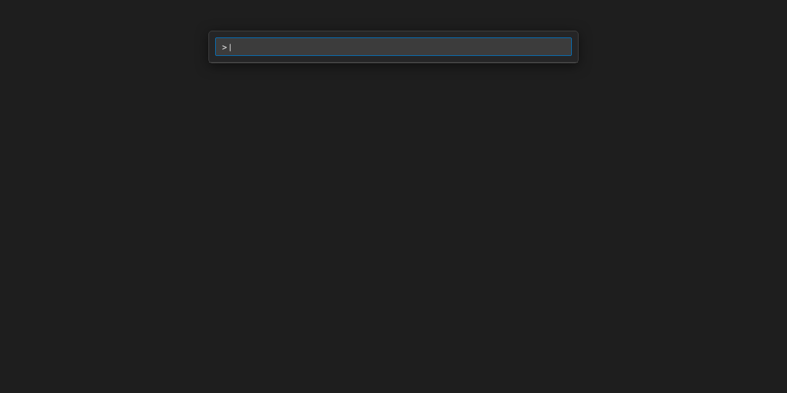

<!-- markdownlint-disable MD041 MD033 -->

<div align="center">

<br/>

# Gherkin PowerTools

**Write cleaner Gherkin. Catch errors earlier. Execute & Debug Behave scenarios in one click.**

AST-powered formatting, validation, navigation, execution, debugging and analytics for Gherkin projects, with first-class Python/Behave support.

<br/>

[](https://marketplace.visualstudio.com/items?itemName=carloscamara.vscode-gherkin-powertools)
[](https://marketplace.visualstudio.com/items?itemName=carloscamara.vscode-gherkin-powertools)
[](https://marketplace.visualstudio.com/items?itemName=carloscamara.vscode-gherkin-powertools)
[](https://marketplace.visualstudio.com/items?itemName=carloscamara.vscode-gherkin-powertools)
[](https://code.visualstudio.com)
[](https://github.com/carlos-camara/vscode-gherkin-powertools/blob/main/LICENSE)

</div>

---

**Jump to:** [Who is this for?](#who-is-this-for) · [Core Capabilities](#core-capabilities) · [Comparison](#compared-to-cucumber-official) · [Quick Start](#quick-start) · [Configuration](#configuration) · [Documentation](https://carlos-camara.github.io/vscode-gherkin-powertools/)

---

## Primary Demo

<div align="center">


*Format Document <kbd>⇧⌥F</kbd> — tables, tags and indentation aligned in one keystroke*

</div>

---

## Compatibility Matrix

| Feature | Any `.feature` file | Python / Behave | Notes |
|---------|:-------------------:|:---------------:|-------|
| Table & Tag Formatting | ✅ | ✅ | Cucumber, Playwright BDD, SpecFlow, Karate |
| Real-Time Syntax Diagnostics | ✅ | ✅ | 70+ languages supported via i18n headers |
| Keyword Quick Fixes | ✅ | ✅ | Auto-inserts missing colons & fixes typos |
| AST Range Selection Formatting | ✅ | ✅ | Format specific step blocks or tables |
| Project Statistics & Tag Telemetry | ✅ | ✅ | Interactive HTML Dashboard |
| Go to Definition | — | ✅ | Jump from step to `@step` decorator |
| Step IntelliSense Autocomplete | — | ✅ | Context-aware by step keyword |
| Run & Debug via CodeLens | — | ✅ | 1-click execution & breakpoint debugging |
| Undefined Step Stub Generator | — | ✅ | Generates Python function stub |

---

## Quick Start

1. Install **Gherkin PowerTools** from the [VS Code Marketplace](https://marketplace.visualstudio.com/items?itemName=carloscamara.vscode-gherkin-powertools).
2. Open any `.feature` file.
3. Press <kbd>Shift+Alt+F</kbd> (<kbd>⇧⌥F</kbd> on macOS) to format your file instantly.

* **Automated Project Onboarding:** Upon opening a Python Behave workspace, Gherkin PowerTools automatically detects step files, `@given`/`@when`/`@then` decorators, and dependency manifests. If step files exist outside standard globs, a non-blocking prompt offers 1-click updates to workspace settings or `.gherkin-powertoolsrc.json`.
* **Zero-Config Non-Behave Support:** Pure Gherkin, Cucumber.js, or SpecFlow projects work 100% zero-configuration for formatting and linting without ever displaying notifications.
* **🐳 100% DevContainer & Remote Ready:** Fully compatible with VS Code Remote (WSL, SSH, Codespaces, DevContainers). Execution processes correctly spawn inside containers, and settings sync reliably without configuration loss.

### Key Shortcuts

| Action | macOS | Windows / Linux |
|--------|-------|-----------------|
| Format Document | <kbd>⇧⌥F</kbd> | <kbd>Shift+Alt+F</kbd> |
| Format Selection | <kbd>⌘K ⌘F</kbd> | <kbd>Ctrl+K Ctrl+F</kbd> |
| Quick Fix | <kbd>⌘.</kbd> | <kbd>Ctrl+.</kbd> |
| Go to Definition | <kbd>⌘Click</kbd> | <kbd>Ctrl+Click</kbd> / <kbd>F12</kbd> |
| Trigger Completion | <kbd>⌃Space</kbd> | <kbd>Ctrl+Space</kbd> |
| Diagnose Workspace | `Gherkin: Diagnose Workspace` | `Gherkin: Diagnose Workspace` |

---

## Core Capabilities

### 1. 🎛️ Command Center
**Problem:** Memorizing keyboard shortcuts and discovering extension capabilities can be overwhelming.  
**Solution:** A unified QuickPick menu provides one-click access to Formatting, Execution, Diagnostics, Statistics, and Code Generation. Access it via the Command Palette (`Gherkin PowerTools: Command Center`).

<div align="center">



</div>

---

### 2. ⚡ AST-Powered Formatting
**Problem:** Misaligned table pipes, messy tags, and erratic indentation create noisy git diffs and slow code reviews.  
**Solution:** Format Document rewrites your feature file using the official `@cucumber/gherkin` AST parser. Tables snap to step text, tags wrap cleanly at 80 characters, and formatting is 100% idempotent.

<div align="center">


</div>

<sub>📖 [Formatter documentation](https://carlos-camara.github.io/vscode-gherkin-powertools/features/formatter.html)</sub>

---

### 3. 🛡️ Real-Time Linter & Quick Fixes
**Problem:** A missing colon or misspelled keyword silently reaches CI and breaks your test pipeline.  
**Solution:** A fully **dialect-aware** AST linter flags structural errors across 70+ languages as you type. One-click Quick Fixes (<kbd>Ctrl+.</kbd> / <kbd>⌘.</kbd>) fix common typos and missing colons instantly.

<div align="center">


</div>

<sub>📖 [Linter documentation](https://carlos-camara.github.io/vscode-gherkin-powertools/features/linter.html)</sub>

---

### 4. 🚀 1-Click Execution & Debugging (CodeLens)
**Problem:** Switching context between the editor and terminal to run isolated scenarios or attach debuggers breaks focus.  
**Solution:** Interactive `▶ Run`, `🐞 Debug`, and `✏️ Edit` buttons appear directly above Features and Scenarios. Additionally, minimal `▶` and `🐞` icons appear next to individual `Examples` data rows. Execute tests using your active VS Code Python environment or step through Python step definitions with breakpoints.

<div align="center">


</div>

<sub>📖 [Execution & Debugging documentation](https://carlos-camara.github.io/vscode-gherkin-powertools/features/execution.html)</sub>

---

### 5. 🔍 Python/Behave Navigation & Step IntelliSense
**Problem:** Finding the Python implementation behind a Gherkin step requires searching through step folders manually.  
**Solution:** <kbd>Cmd+Click</kbd> / <kbd>Ctrl+Click</kbd> any step to jump straight to its Python `@given`, `@when`, `@then` decorator. Get context-aware step completion and preview function signatures on hover.

<div align="center">


</div>

<sub>📖 [Go to Definition](https://carlos-camara.github.io/vscode-gherkin-powertools/features/definition.html) · [Hover](https://carlos-camara.github.io/vscode-gherkin-powertools/features/hover.html)</sub>

---

### 6. 📊 Workspace BDD Analytics
**Problem:** Difficulty assessing the size, health, and test distribution of your BDD suite.  
**Solution:** The Project Statistics dashboard compiles workspace metrics: feature counts, scenario outlines, step ratios, tag telemetry, and a Gherkin Quality Indicator.

<div align="center">


</div>

<sub>📖 [Statistics documentation](https://carlos-camara.github.io/vscode-gherkin-powertools/features/statistics.html) · [Full Visual Demo Gallery](https://carlos-camara.github.io/vscode-gherkin-powertools/demos.html)</sub>

---

### 7. 🤖 Zero-Configuration Onboarding & Diagnostics
**Problem:** Setting up paths and configuring the extension for complex Python workspaces requires reading documentation and tweaking JSON.  
**Solution:** A silent background scanner automatically detects Behave projects, analyzes coverage gaps, and proactively offers to configure your workspace with 1 click. Run deep workspace diagnostics to troubleshoot setup issues instantly.

<div align="center">


</div>

<sub>📖 [Automated Onboarding documentation](https://carlos-camara.github.io/vscode-gherkin-powertools/features/onboarding.html) • [Diagnostics documentation](https://carlos-camara.github.io/vscode-gherkin-powertools/features/diagnostics.html)</sub>

---

## Who is this for?

Gherkin PowerTools is built for QA engineers, developers, and BDD teams working with Gherkin feature files.

### ❓ Do I need Behave / Python?
**No!**

* **Any `.feature` file (Cucumber.js, Playwright BDD, SpecFlow, Karate, etc.):**
  Zero-configuration AST-based formatting, real-time syntax linting, 70+ language i18n support, AST range selection formatting, tag telemetry, and workspace statistics work out-of-the-box for **every** Gherkin project.
* **Python / Behave Workspaces:**
  Unlocks deep step definition indexing (Go to Definition, Hover, IntelliSense), missing step stub generator, and 1-click test **Execution & Debugging** via CodeLens directly inside VS Code.

---

## Compared to Cucumber Official

Both extensions can coexist peacefully and serve complementary purposes:

| Capability | Gherkin PowerTools | Official Cucumber |
|-----------|:-----------------:|:-----------------:|
| Table alignment | ✅ Dynamic to step keyword | ✅ Basic |
| Tag wrapping & sorting | ✅ | — |
| Real-time structural linting | ✅ AST-based | ✅ Syntax + undefined steps |
| Keyword Quick Fixes | ✅ | — |
| Python / Behave Navigation | ✅ First-class | — |
| 1-Click Run & Debug | ✅ CodeLens | — |
| Workspace Statistics Dashboard | ✅ | — |
| Language Server Protocol (LSP) | — | ✅ (all frameworks) |

*💡 **PRO-TIP:** Install both! Gherkin PowerTools handles formatting, linting, Python/Behave navigation, execution, and analytics. The Official Cucumber extension provides generic LSP support for JavaScript/Java frameworks.*

---

## Configuration

Share formatting and step discovery settings across your team by creating a `.gherkin-powertoolsrc.json` in the root of your project:

```json
{
  "indentation": { "steps": 4 },
  "behave": {
    "stepGlobs": ["**/steps/**/*.py", "**/features/steps/**/*.py"]
  }
}
```

Or enable **Format on Save** in your VS Code settings:

```jsonc
// .vscode/settings.json
"[feature]": {
  "editor.defaultFormatter": "carloscamara.vscode-gherkin-powertools",
  "editor.formatOnSave": true
}
```

### Key Settings

| Setting | Default | Description |
|---------|---------|-------------|
| `gherkinPowerTools.indentation.steps` | `4` | Number of spaces to indent steps |
| `gherkinPowerTools.tables.alignToKeyword` | `true` | Align pipes to step text start |
| `gherkinPowerTools.tags.format` | `"wrap"` | `"wrap"` or `"singleLine"` for tag lists |
| `gherkinPowerTools.tags.sort` | `"preserve"` | `"preserve"` or `"alphabetical"` for tag ordering |
| `gherkinPowerTools.emptyLines.betweenScenarios` | `1` | Empty lines between scenario blocks |
| `gherkinPowerTools.behave.stepGlobs` | `["**/steps/**/*.py", "**/features/steps/**/*.py"]` | Glob patterns for Python step files |
| `gherkinPowerTools.behave.ignoreGlobs` | `["**/node_modules/**", "**/.venv/**", "**/venv/**", "**/env/**"]` | Paths to exclude from step indexing |
| `gherkinPowerTools.behave.additionalArguments` | `[]` | Additional flags passed to Behave |
| `gherkinPowerTools.behave.command` | `"behave"` | Base command used to run Behave via CodeLens |

📖 [Full Configuration Reference & Documentation](https://carlos-camara.github.io/vscode-gherkin-powertools/)

---

## Contributing & License

Contributions are welcome! Please check out the [Contributing Guide](https://github.com/carlos-camara/vscode-gherkin-powertools/blob/main/CONTRIBUTING.md).

Released under the [MIT License](https://github.com/carlos-camara/vscode-gherkin-powertools/blob/main/LICENSE) — © [Carlos Camara](https://github.com/carlos-camara).
