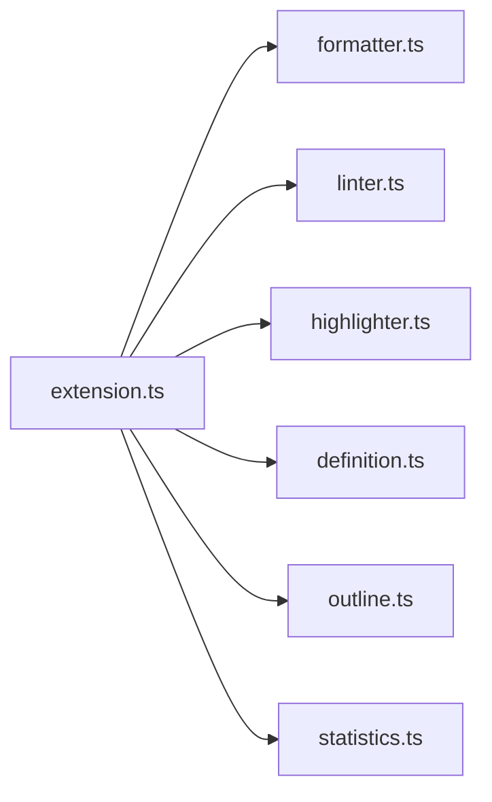
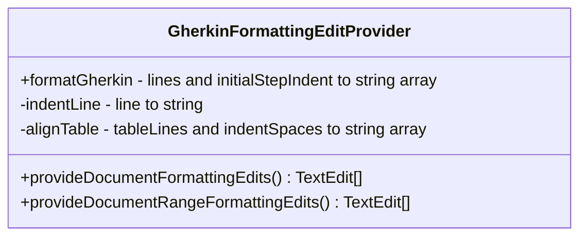
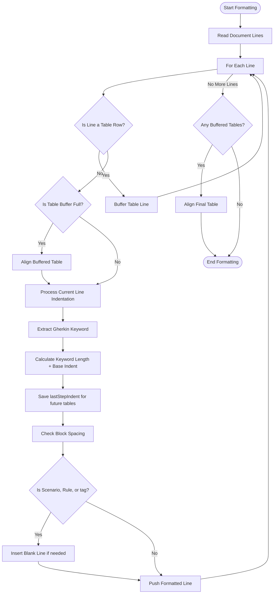

# Architecture

This document describes the internal architecture of the **Gherkin PowerTools** Visual Studio Code extension.

## High-Level Architecture

The extension is designed around a fast, memory-efficient line-parsing engine that avoids building a full Abstract Syntax Tree (AST). Since formatting Gherkin mainly concerns indentation, block spacing, and table alignment, a streaming line parser is vastly more performant.

### Module Map



| Module | Responsibility |
|--------|---------------|
| `extension.ts` | Entry point. Registers all commands, providers, and diagnostics |
| `formatter.ts` | Core formatting engine: indentation, table alignment, auto-casing, tag wrapping |
| `highlighter.ts` | Custom semantic syntax highlighting via `createTextEditorDecorationType` |
| `linter.ts` | Real-time syntax checking via regex, generates `vscode.Diagnostic` warnings |
| `definition.ts` | Go-To-Definition provider: searches `steps/` for Python decorators |
| `outline.ts` | Hierarchical tree of `Feature > Rule > Scenario` for the Outline panel |
| `statistics.ts` | Interactive HTML Webview dashboard with BDD project metrics |

## The Formatting Engine



The core logic implements two key VS Code interfaces:

1. `vscode.DocumentFormattingEditProvider` (Full file formatting)
2. `vscode.DocumentRangeFormattingEditProvider` (Selection formatting)

## Line Parsing Workflow



## Table Alignment Algorithm

The most complex part of the extension is the dynamic table alignment algorithm.

### Example Trace

Given the following raw input:

```gherkin
Given I have a database
|id|name|
|1|admin|
```

1. The parser hits `Given I have a database`
2. It applies a base indent of `4 spaces`
3. It runs a regex to capture the keyword `Given` (length 5)
4. It calculates: `baseIndent (4) + keywordLength (5) + space (1) = 10`
5. `lastStepIndent` is stored as `10`
6. The parser buffers the table rows
7. Upon hitting the end, it flushes to `alignTable(buffer, 10)`
8. `alignTable` splits columns by `|`, calculates max widths, and pads with `.padEnd()`

Result:

```gherkin
    Given I have a database
          | id | name  |
          | 1  | admin |
```
