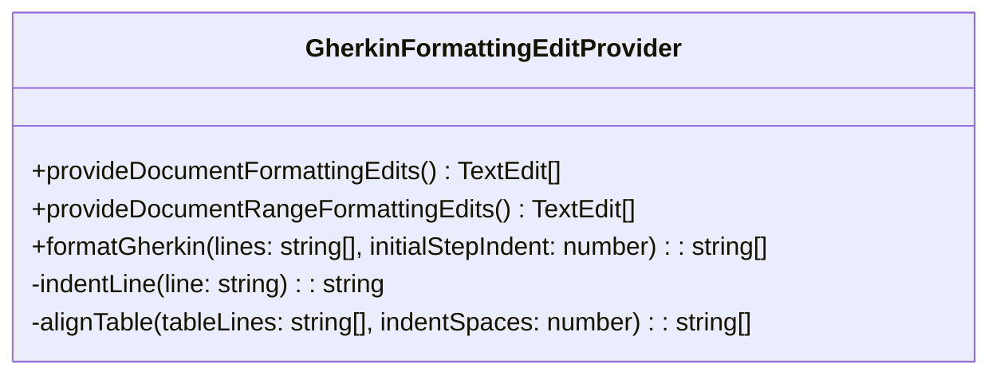

# Gherkin Beautifier Architecture

This document describes the internal architecture of the **Gherkin Beautifier** Visual Studio Code extension.

## High-Level Architecture

The extension is designed around a fast, memory-efficient line-parsing engine that avoids building a full Abstract Syntax Tree (AST). Since formatting Gherkin mainly concerns indentation, block spacing, and table alignment, a streaming line parser is vastly more performant.

### The Formatting Engine



The core logic lives in `GherkinFormattingEditProvider`, which implements two key VS Code interfaces:
1. `vscode.DocumentFormattingEditProvider` (Full file formatting)
2. `vscode.DocumentRangeFormattingEditProvider` (Selection formatting)

## Line Parsing Workflow

When a format request is triggered, the engine executes the following logic:

```mermaid
flowchart TD
    Start([Start Formatting]) --> ReadLines[Read Document Lines]
    ReadLines --> Loop[For Each Line]
    
    Loop --> CheckTable{Is Line a Table Row?}
    
    CheckTable -- Yes --> Buffer[Buffer Table Line]
    Buffer --> Loop
    
    CheckTable -- No --> FlushCheck{Is Table Buffer Full?}
    FlushCheck -- Yes --> Align[Align Buffered Table]
    Align --> Indent[Process Current Line Indentation]
    FlushCheck -- No --> Indent
    
    Indent --> ExtractKeyword[Extract Gherkin Keyword]
    ExtractKeyword --> Regex[Regex: `^(Given|When|Then|And|But|\*)`]
    Regex --> CalculateDynamicIndent[Calculate Keyword Length + Base Indent]
    CalculateDynamicIndent --> SaveState[Save `lastStepIndent` for future tables]
    
    SaveState --> BlockSpacing[Check Block Spacing]
    BlockSpacing --> IsNewBlock{Is `Scenario`, `Rule`, or `@tag`?}
    IsNewBlock -- Yes --> InsertBlank[Insert Blank Line if needed]
    IsNewBlock -- No --> Push[Push Formatted Line]
    InsertBlank --> Push
    
    Push --> Loop
    
    Loop -- No More Lines --> FinalFlush{Any Buffered Tables?}
    FinalFlush -- Yes --> AlignFinal[Align Final Table]
    AlignFinal --> End([End Formatting])
    FinalFlush -- No --> End
```

## Table Alignment Algorithm (Dynamic Indentation)

The most complex part of the extension is the dynamic table alignment algorithm. Traditional formatters align tables to a hardcoded 6 or 8 spaces. This extension aligns tables to match the text of the preceding step.

### Example Trace

Given the following raw input:
```gherkin
Given I have a database
|id|name|
|1|admin|
```

1. The parser hits `Given I have a database`.
2. It applies a base indent of `4 spaces`. Result: `    Given I have a database`.
3. It runs a regex to capture the keyword `Given` (length 5).
4. It calculates the start of the text: `baseIndent (4) + keywordLength (5) + space (1) = 10`.
5. `lastStepIndent` is stored in memory as `10`.
6. The parser hits the table rows and buffers them.
7. Upon hitting the end of the file, it flushes the buffer to `alignTable(buffer, 10)`.
8. `alignTable` splits columns by `|`, calculates max widths for each column index, and reconstructs the strings with `.padEnd()`.
9. Finally, it prepends `10 spaces` to every row.

Result:
```gherkin
    Given I have a database
          | id | name  |
          | 1  | admin |
```
