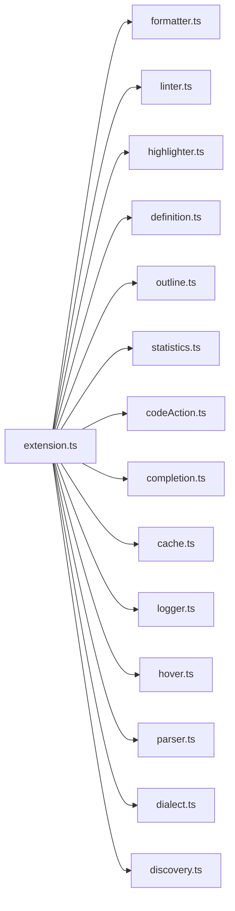
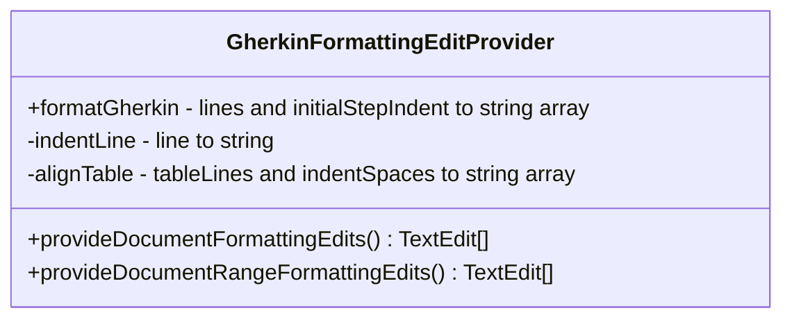

# Architecture

This document describes the internal architecture of the **Gherkin PowerTools** Visual Studio Code extension.

## High-Level Architecture

The extension is built on a Hybrid Parsing Engine.
While formatting is traditionally difficult for whitespace-sensitive languages, we use the official `@cucumber/gherkin` Abstract Syntax Tree (AST) to perform structural analysis.
If the AST fails due to catastrophic syntax errors (e.g., a user currently typing a malformed line), our Live Diagnostics Linter seamlessly falls back to a custom text-based scanner to ensure the extension continues to function.

### Module Map



| Module | Responsibility |
|--------|---------------|
| `extension.ts` | Entry point. Bundled via **Esbuild** for fast activation. Registers all commands, providers, and diagnostics. |
| `formatter.ts` | Core formatting engine: indentation, table alignment, tag wrapping |
| `highlighter.ts` | Custom semantic syntax highlighting via `createTextEditorDecorationType` |
| `linter.ts` | Real-time syntax checking via `@cucumber/gherkin` AST, with fallback text scanning. |
| `definition.ts` | Go-To-Definition provider: accesses `cache.ts` for instant lookups |
| `outline.ts` | Hierarchical tree of `Feature > Rule > Scenario` for the Outline panel |
| `statistics.ts` | Interactive HTML Webview dashboard displaying heuristic workspace metrics |
| `codeAction.ts`| Generates quick fixes (💡) for undefined steps or syntax typos |
| `completion.ts`| Smart IntelliSense autocompletion parsing regex into Snippets |
| `cache.ts`     | Asynchronous caching engine that non-blockingly indexes the workspace via `vscode.workspace.findFiles` |
| `logger.ts`    | Native VS Code Output Channel for tracing |
| `hover.ts`     | Provides hover information (function signatures, docstrings, tag blast radius) |
| `parser.ts`    | Handles AST parsing and caching of Gherkin documents |
| `dialect.ts`   | Provides i18n support by matching localized Gherkin keywords |
| `discovery.ts` | Centralized Behave file discovery service handling glob normalization and reactive file watchers |

## Hot-Reloading Configuration

The extension is designed to respond to configuration changes instantly without requiring a window reload.
When settings like `gherkinPowerTools.behave.stepGlobs` are modified, `extension.ts` interacts with `discovery.ts` to immediately tear down old file system watchers, instantiate new ones, and instruct the `SymbolCache` to re-index the workspace and trigger live re-linting of all open feature documents.


## Semantic Step Matching

In traditional Gherkin engines, steps are resolved solely by matching regex patterns against the trailing text. However, frameworks like Behave allow identically worded steps differentiated only by their semantic decorator (`@given("I log in")` vs `@when("I log in")`).
Gherkin PowerTools correctly respects these semantic constraints. The `DialectService` traverses backwards through the Gherkin document to resolve contextual semantic types for continuation keywords (`And`, `But`). This inferred semantic type is passed synchronously into the `SymbolCache`, which strictly filters autocomplete snippets, hover documentation, Go-To-Definition links, and Linter diagnostics to only present perfectly valid contexts without throwing ambiguous step errors. Generic `@step` decorators are treated as wildcards.

## The Formatting Engine

While parsing relies on the AST for semantic validation, the `formatter.ts` leverages regex-based token extraction combined with AST localization to perform block-spacing and table alignment without altering invalid lines.



The core logic implements two key VS Code interfaces:

1. `vscode.DocumentFormattingEditProvider` (Full file formatting)
2. `vscode.DocumentRangeFormattingEditProvider` (Selection formatting)

## Line Parsing Workflow


## Table Alignment Algorithm

The most complex part of the extension is the dynamic table alignment algorithm.

### Example Trace

Given the following raw input:

```gherkin
Given I have a database
|id|name|
|1|admin|
```

1. The parser hits `Given I have a database`
2. It applies a base indent of `4 spaces`
3. It runs a regex to capture the keyword `Given` (length 5)
4. It calculates: `baseIndent (4) + keywordLength (5) + space (1) = 10`
5. `lastStepIndent` is stored as `10`
6. The parser buffers the table rows
7. Upon hitting the end, it flushes to `alignTable(buffer, 10)`
8. `alignTable` splits columns by `|`, calculates max widths, and pads with `.padEnd()`

Result:

```gherkin
    Given I have a database
          | id | name  |
          | 1  | admin |
```
