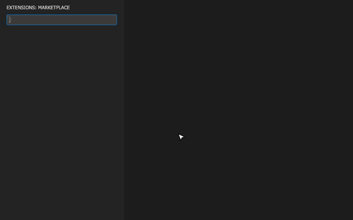
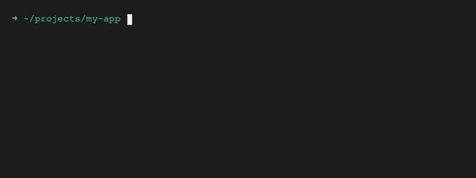

<!-- markdownlint-disable MD046 -->
# 🚀 Installation

## From the VS Code Marketplace

1. Open Visual Studio Code.
2. Navigate to the Extensions view (`Ctrl+Shift+X` / `Cmd+Shift+X`).
3. Search for **"Gherkin PowerTools"**.
4. Click **Install**.

<div align="center">
  
</div>

## From a `.vsix` File

If you have a pre-built `.vsix` package (e.g., from a GitHub Release):

```bash
code --install-extension vscode-gherkin-powertools-<version>.vsix
```

<div align="center">
  
</div>

<div style="border-radius: 8px; overflow: hidden; margin: 20px 0; box-shadow: 0 2px 8px rgba(0,0,0,0.2); border: 1px solid #d1d5db;">
  <div style="background: #1f2937; padding: 10px 16px; display: flex; align-items: center; gap: 8px;">
    <span style="font-size: 16px;">💡</span>
    <span style="color: #f9fafb; font-weight: 700; font-size: 13px; letter-spacing: 0.5px; text-transform: uppercase;">Pro-Tip: Auto-Formatting</span>
  </div>
  <div style="background-color: #ffffff; padding: 14px 16px; display: flex; flex-direction: column; gap: 10px;">
    <span style="color: #374151; font-size: 13px;">To unleash the full power of the extension, enable <strong style="color: #111827;">Format on Save</strong> specifically for Gherkin files:</span>
    <pre style="background:#f3f4f6; border: 1px solid #d1d5db; border-radius: 6px; padding: 10px 14px; margin: 0; font-size: 12px; color: #1f2937; overflow-x: auto;"><code>"[feature]": {
    "editor.defaultFormatter": "carloscamara.vscode-gherkin-powertools",
    "editor.formatOnSave": true
}</code></pre>
  </div>
</div>

    Add this to your `.vscode/settings.json` or your global User Settings.
